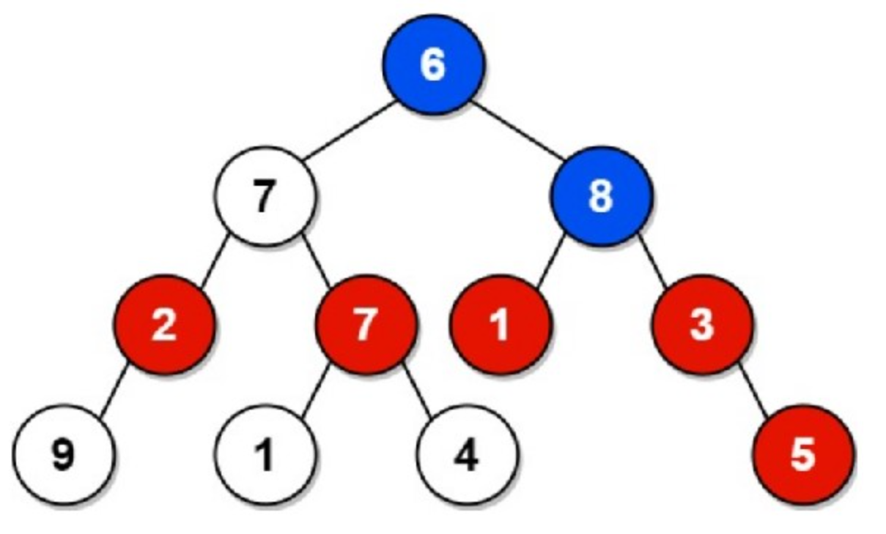

# Mysterious Binary Trees

Once upon a time in the Binary Kingdom, there existed a mystical forest filled with enchanting binary trees. The binary trees were not just ordinary trees; they held a secret power within them. The nodes of these trees were adorned with unique non-negative integer values, each representing a piece of the tree's magical essence.

Our protagonist, a skilled programmer named Ashish, discovered a hidden prophecy that spoke of unlocking the true potential of these magical binary trees. The challenge was to write a program that could **calculate the total sum of values of grandparents for every node in a given binary tree**, considering the following rules that were simple yet mystical:

* **Only the even-valued grandparents are to be considered.**
* **If a node's grandparent doesn't exist, no action is required for that node.**

Ashish, with determination in his heart, solved the coding challenge and unlocked the magical potential of the binary trees. The Binary Kingdom rejoiced in the new found magic, and Ashish became a legendary coder celebrated for his ability to unveil the mysteries of the enchanted forest.

Now, the challenge awaits you! Can you write a program to reveal the magic hidden within the binary trees and calculate the grand total of even-valued grandparents? The mystical forest awaits your code!

## Definition:
In the context of this problem, **the grandparent of a node is the parent of its parent. Specifically, if a node with index *i* has a parent with index *j*, and the node with index *j* has a parent with index *k*, then the grandparent of node *i* is the node with the index *k*.**

**Note: For some nodes, grandparent might not exist.**

**EXAMPLE**

`arr = [6 7 8 2 7 1 3 9 -1 1 4 -1 -1 -1 5]`


The red nodes 2, 7, 1, 3 are the grandchildren of the blue even-valued grandparent node 6 whereas the red node 5 is grandchild of the blue even-valued grandparent node 8.

## Input
The first line contains an integer an ***N*** representing the size of the array.

Next line contains ***N*** space separated integers representing the tree, such that, node *i* has the left node at *2i+1* and right node at *2i+2* (following 0-based indexing). **If there is no node then its value would be -1.**

**EXAMPLE**

`arr = [1 -1 2 -1 -1 4 3]`


**Function is given that converts the array into tree and returns the pointer to the root of the tree.**

The input would thus effectively be modified to give Nodeptr A, where:
* Node is a structure representing a node in the binary tree.
* Each node has an integer value, and a left and right child pointer.

```
#include<stdio.h>
#include<stdlib.h>
#include<assert.h>
#include <stdbool.h>

typedef struct Node Node;
typedef struct Node* Nodeptr;
struct Node{
    int val;
    Nodeptr right;
    Nodeptr left;
};

Nodeptr init(int x){
    Nodeptr head = (Nodeptr)malloc(sizeof(Node));
    head->right = NULL;
    head->left = NULL;
    head->val = x;
    return head;
}

Nodeptr createTree(int* arr, int n){
    
    Nodeptr v[n];
    for(int i=0;i<n;i++){
        if(arr[i] != -1){
            v[i] = init(arr[i]);
        }
    }

    int idx = 0;
    
    while(idx<n){
        if(arr[idx] == -1){
            idx+=1;
            continue;
        }
        if(2*idx+1<n && arr[2*idx+1]!=-1){
            v[idx]->left = v[2*idx+1];
        }
        if(2*idx+2<n && arr[2*idx+2]!=-1){
            v[idx]->right = v[2*idx+2];
        }
        idx+=1;
    }
    return v[0];
}
```

## Output:

A single integer representing the total sum of values of even-valued grandparents satisfying the conditions.


## Constraints
* The number of nodes in the tree, N: 1<=N<=1e5

* The value of each element in the array is an integer in the range [-1, 1e7].

**NOTE:** The input arrays for trees should only be used to construct binary trees. If used anywhere else, there will be severe penalty.

## Sample Test Cases:

### Input:

```
15
6 7 8 2 7 1 3 9 -1 1 4 -1 -1 -1 5
```

### Output:

```
32
```
### Explanation:
The tree is visualised above. For nodes 2,7,1,3  has 6 as grandparent which is even-valued. Similarly, 5 has 8 as grandparent which is again even-valued. So total Sum is 6*4+8=32.Other nodes that have grandparent is not even valued.

### Input:

```
1
1
```

### Output:

```
0
```