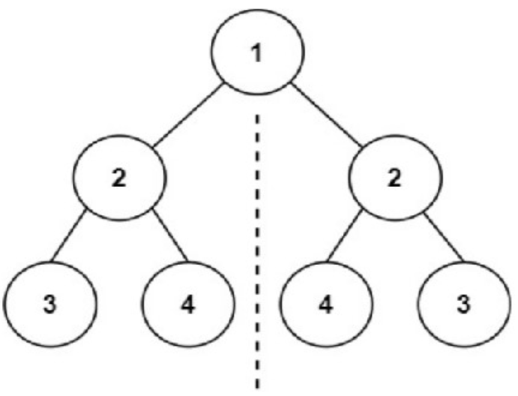

# Pronoy's Mirror of Joy

In the enchanting land of Codeville, there lived a young and enthusiastic programmer named Pronoy. Pronoy had a unique hobby – he loved exploring the mystical world of binary trees. His friends often marveled at his ability to find joy in the intricate structures of these trees.

One day, as Pronoy was delving into his latest binary tree adventure, he stumbled upon a rumor about a legendary tree known as the "Mirror of Joy." Legend had it that this tree possessed a symmetrical structure, and anyone who could verify its symmetry would be bestowed with everlasting happiness.

Eager to embark on this quest for joy, Pronoy set out to write a magical function that would determine whether a given binary tree was symmetrical. He named his function `bool isSymmetrical(Nodeptr root)` and knew that it would hold the key to unlocking the Mirror of Joy.


Pronoy was excited about the challenge that lay ahead. He saw it as an opportunity not only to bring happiness to himself but also to share the joy of symmetry with his friends in Codeville. Little did he know that this journey would lead him to discover the beauty of balance and the happiness that comes from a perfectly mirrored world.

Here is the formal problem statement that Pronoy encountered:
##Formal Statement
You are given an array representing nodes of a binary tree. You are also provided with a function that converts the array into a binary tree and returns the tree's root. Your task is to pass the array and its size through the provided function.

The input would thus effectively be modified to argument, Nodeptr A.
You have to write code that takes the tree's root as input and prints **"YES"** if it is symmetrical, otherwise prints **"NO"**.

## Definition
**A binary tree is considered symmetrical if it is a mirror image of itself around its center.** In other words, if you can draw a vertical line through the center of the tree and the left and right subtrees are identical, the tree is symmetrical.

**EXAMPLE**
`arr = [1 2 2 3 4 4 3]`


## Input
The first line contains an integer an ***N*** representing the size of the array.

Next two line contains ***N*** space separated integers representing the tree arr[i] for 0<=i<=N-1, such that, node *i* has the left node at *2i+1* and right node at *2i+2* (following 0-based indexing). If there is no node then its value would be -1.

**EXAMPLE**
`arr = [1 -1 2 -1 -1 4 3]`


**Function is given that converts the array into tree and returns the pointer to the root of the tree:**

* Node is a structure representing a node in the binary tree.
* Each node has an integer value, and a left and right child pointer.

```
#include<stdio.h>
#include<stdlib.h>
#include<assert.h>
#include <stdbool.h>

typedef struct Node Node;
typedef struct Node* Nodeptr;
struct Node{
    int val;
    Nodeptr right;
    Nodeptr left;
};

Nodeptr init(int x){
    Nodeptr head = (Nodeptr)malloc(sizeof(Node));
    head->right = NULL;
    head->left = NULL;
    head->val = x;
    return head;
}

Nodeptr createTree(int* arr, int n){
    
    Nodeptr v[n];
    for(int i=0;i<n;i++){
        if(arr[i] != -1){
            v[i] = init(arr[i]);
        }
    }

    int idx = 0;
    
    while(idx<n){
        if(arr[idx] == -1){
            idx+=1;
            continue;
        }
        if(2*idx+1<n && arr[2*idx+1]!=-1){
            v[idx]->left = v[2*idx+1];
        }
        if(2*idx+2<n && arr[2*idx+2]!=-1){
            v[idx]->right = v[2*idx+2];
        }
        idx+=1;
    }
    return v[0];
}
```

## Output
* Print **"YES"** if the tree is symmetrical.
* Print **"NO"** otherwise.


## Constraints
* The size of the array, N: **1<=N<=1e5**
* The value of each element of array is an integer in the range **[-1, 1e7]**.

**NOTE:** The input arrays for trees should only be used to construct binary trees. If used anywhere else, there will be severe penalty.

## Sample Test Cases:

### Input:

```
7
1 2 2 3 4 4 3
```

### Output:

```
YES
```
### Explanation:
The tree is visualized in the Example above.

### Input:

```
7
1 2 2 -1 3 -1 3
```

### Output:

```
NO
```