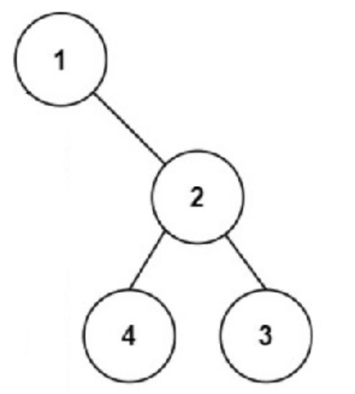
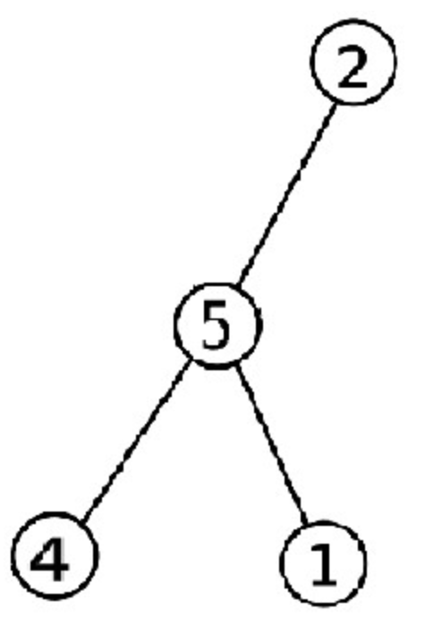

# Ashish's Garden of Good Nodes

In the tranquil village of AlgoVale, there lived a young gardener named Ashish who had a passion for cultivating binary trees. Ashish's trees were not ordinary; they were special, filled with nodes that held the essence of goodness. He believed that **a node in his tree is *"good"* if, on the path from that node to the root, there were no other nodes with values greater than the value of the current node.**

One sunny day, as Ashish was tending to his binary tree garden, he received a letter from the wise elders of AlgoVale. The letter contained a challenge that stirred his curiosity. The elders asked him to **count the number of *"good"* nodes in his binary tree** and promised that, upon completion, he would uncover a secret pathway leading to the heart of the village.

Excited by the prospect of a hidden pathway and the chance to showcase the goodness of his trees, Ashish set out to write a function named `int countGoodNodes(Nodeptr root)` that would help him fulfill the elders' request.

Ashish saw this challenge as an opportunity to showcase the beauty of his trees and their inherent goodness. He embraced the task with enthusiasm, knowing that his binary tree garden held the key to unveiling the secret pathway that would connect him to the heart of AlgoVale. Little did he know that this journey would not only reveal the goodness of her trees but also the kindness that comes from counting and appreciating the good nodes in our lives.

Here is the formal problem statement that Ashish faced:

## Formal Statement
You are given an array representing nodes of a binary tree. You are also provided with a function that converts the array into a binary tree and returns the tree's root. Your task is to pass the array along with its size through the provided function.

The input would thus effectively be modified to an argument, Nodeptr root. Then, you must write a code that takes tree's root as input and counts the number of "good" nodes.

## Input
The first line contains an integer **N** representing the size of the array.

Next line contains *N* space separated integers, arr[i] 0<=i<=N-1 representing the nodes of the tree, such that, node *i* has the left node at *2i+1* and right node at *2i+2* (following 0-based indexing). If there is no node then its value would be -1.

**EXAMPLE**
`arr = [1 -1 2 -1 -1 4 3]`


**Function is given that converts the array into tree and returns the pointer to the root of the tree: **

* Node is a structure representing a node in the binary tree.
* Each node has an integer value, and a left and right child pointer.

```
#include<stdio.h>
#include<stdlib.h>
#include<assert.h>
#include <stdbool.h>

typedef struct Node Node;
typedef struct Node* Nodeptr;
struct Node{
    int val;
    Nodeptr right;
    Nodeptr left;
};

Nodeptr init(int x){
    Nodeptr head = (Nodeptr)malloc(sizeof(Node));
    head->right = NULL;
    head->left = NULL;
    head->val = x;
    return head;
}

Nodeptr createTree(int* arr, int n){
    
    Nodeptr v[n];
    for(int i=0;i<n;i++){
        if(arr[i] != -1){
            v[i] = init(arr[i]);
        }
    }

    int idx = 0;
    
    while(idx<n){
        if(arr[idx] == -1){
            idx+=1;
            continue;
        }
        if(2*idx+1<n && arr[2*idx+1]!=-1){
            v[idx]->left = v[2*idx+1];
        }
        if(2*idx+2<n && arr[2*idx+2]!=-1){
            v[idx]->right = v[2*idx+2];
        }
        idx+=1;
    }
    return v[0];
}
```

## Output
Print the number of *"good"* nodes in the binary tree.


## Constraints
* The size of the array is, N: 1<=N<=1e5.
* The value of each element in the array is an integer in the range [-1, 1e7].

**NOTE:** The input arrays for trees should only be used to construct binary trees. If used anywhere else, there will be severe penalty.

## Sample Test Cases:

### Input:

```
5
2 5 -1 4 1
```

### Output:

```
2
```
### Explanation:
Only the nodes 2 and 5 are *"good"* in the formed tree, as shown.


### Input:

```
3
1 2 3
```

### Output:

```
3
```